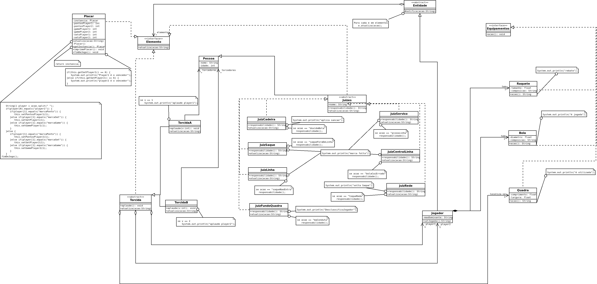
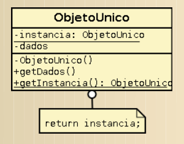
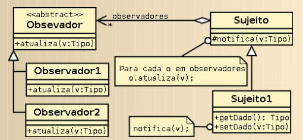

# Simples modelagem de esporte - Tênis 

A disciplina ECOT12 - projeto de software, ministrada pelo professor Enzo Seraphim - UNIFEI, tem como objetivo ensinar a diagramar em UML, aplicar padrões de projeto e desenvolver POO em java, sendo assim durante o curso isso é ensinado, e como avaliação do aprendizado no laboratório, um projeto é proposto aos alunos.

No primeiro semestre de 2022 o projeto proposto consistia em modelar e desenvolver em linguagem java um esporte. O esporte que escolhi foi o tênis.
Os requisitos para o desenvolvimento do projeto foram:
- Diagrama UML utilizando 20 classes.
- Aplicação de 2 dos padrões de projeto ensinado no livro "Padrões de projeto, Gamma."
- Desenvolvimento em java de acordo com o diagrama UML criado previamente.

## Diagrama UML

## 🚀 Padrões de projeto aplicados 

Os dois padrões de projeto aplicados são: objeto único (Singleton) e observador (Observer). 

### Singleton

Esse padrão foi aplicado para que o jogo só tivesse um placar, e qualquer outra tentativa de instanciação de um placar no jogo, iria resultar no placar já existente que está sendo alterado conforme o andamento da partida.
Ou seja, de acordo com Gamma, está garantindo que uma classe só tenha uma única instância e provendo um ponto de acesso global a ela.

### Observer

Esse padrão foi aplicado para que todos os observadores do jogo (torcida, juizes e placar) 
fossem notificados quando um Jogador realizasse uma ação.
ou seja, de acordo com Gamma, está definindo uma depência de um-para-muitos (jogador para torcida, juizes e placar) para que toda vez que o jogador (classe filha de Entidade), mudar de estado, então as classes que implementaram a interface Elemento (Placar, Torcida e Juizes), sejam notificadas e atualizadas.

## ✒️ Autor

* **Alyson Henrique** - *Desenvolvimento* - [alysondv](https://github.com/alysondv)
